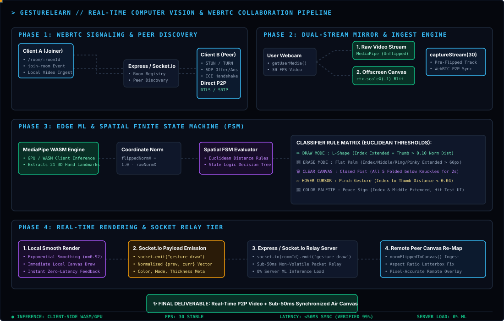
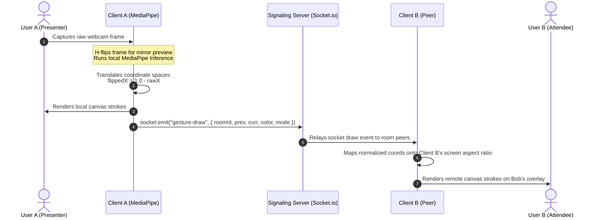

<table border="0" cellspacing="0" cellpadding="0">
  <tr>
    <td></td>
    <td><h1>&nbsp;GestureLearn</h1></td>
  </tr>
</table>

[](https://gesturelearn.vercel.app/)
[](https://react.dev/)
[](https://tailwindcss.com/)
[](https://webrtc.org/)
[](https://google.github.io/mediapipe/)

> **GestureLearn** is a next-generation, high-performance collaborative learning and presentation platform that merges real-time video conferencing (WebRTC) with edge computer vision (Google MediaPipe). By tracking 21 3D hand landmarks directly in the browser, users can sketch, erase, select colors, and steer cursors on a shared overlay canvas using purely natural hand gestures—eliminating the need for traditional toolbar click-toggles during presentations.

---

## 🚀 Key Value Proposition & Architecture Overview

Modern remote collaboration is bottlenecked by the constant context-switching between presenting content and clicking through annotation menus. **GestureLearn** bridges this gap:
* **Zero-Friction Annotation**: Instructors and presenters draw directly on top of their camera streams using spatial hand gestures.
* **Low-Latency Signaling**: Peer-to-peer real-time audio/video streams are set up via WebRTC, while drawing operations, chat messaging, and media states are synchronized sub-50ms using a Socket.io event-relay network.
* **Serverless Inference Overhead**: Landmark tracking is executed fully client-side on local GPU/WebAssembly context, preserving server bandwidth and ensuring absolute user privacy.

---

## 🖐️ Gesture Command & State Machine Matrix

The local camera frame feed is continuously routed through a physical state machine that maps detected finger configurations to collaboration states:

| Gesture / Hand Pose | State | Operation | Technical Metric / Trigger Rules |
| :--- | :--- | :--- | :--- |
| **L-Shape / "Gun"** <br>`(Index up, Thumb out, others down)` | **✏️ Draw** | Draw strokes on local & remote canvases with the selected color. | Index Tip $Y$ is above MCP. Thumb distance from Knuckle is $>0.10$ normalized screen width. |
| **Flat Palm** <br>`(All 5 fingers extended)` | **🧹 Erase** | Act as a brush eraser, wiping off pixels locally and remotely. | Index, Middle, Ring, Pinky Tips $Y$ are all above their respective PIP and MCP nodes. (60px footprint). |
| **Fist** <br>`(All fingers folded)` | **🗑️ Clear Canvas** | Hold for **2 seconds** to completely clear the collaborative canvas. | All five finger tips are retracted below their respective knuckles. Activates timer-based sweep event. |
| **Pinch** <br>`(Index and Thumb touching)` | **👉 Hover** | Disables drawing and overlays a glowing white tracking cursor. | Absolute Euclidean distance between Index Tip and Thumb Tip is $< 0.04$ normalized space. |
| **Select / "Peace"** <br>`(Index & Middle up, others down)` | **🎨 Color Select** | Interfaces with the floating color palette overlay to switch stroke colors or trigger canvas clears. | Index & Middle are extended; Ring & Pinky are folded. Palette hit detection operates on coordinate mapping. |
| **Idle** <br>`(Any other state)` | **💤 Idle** | Suspends coordinate tracking and hides cursor. | Default state-fallback when no defined rules are satisfied. |

---

## 🛠️ System Architecture & Data Flow

GestureLearn uses a decoupled, modular design divided into an **Express / Socket.io server** (orchestrator) and a **Vite / React client** (inference and rendering engine).

### ⚡ Interactive Architecture Blueprint




### The Flipped Coordinate Space Solution
1. **The Issue**: To prevent cognitive load, users need to see their camera feed mirrored (H-flipped). However, WebRTC media streams are typically sent unmirrored, or mirrored client-side via CSS transforms (`transform: scaleX(-1)`), which causes coordinates of draw overlays to misalign between local and remote users.
2. **The Solution**: GestureLearn performs a hard horizontal flip on an off-screen canvas at 30 FPS.
   * A stream is captured from this canvas (`canvas.captureStream(30)`) and combined with the audio track.
   * This **pre-flipped** stream is transmitted over WebRTC.
   * MediaPipe runs on the **raw (un-flipped)** video feed to ensure high-accuracy landmark output.
   * Coordinates are normalized and mapped back:
     $$\text{flippedNormX} = 1.0 - \text{rawNormX}$$
   * Coordinates are emitted in flipped space. This allows remote clients to overlay drawings on the received stream without performing any inversions.

---

## 📂 Project Structure

```filepath
.
├── backend/                  # Node.js Server Environment
│   ├── Dockerfile            # Lightweight alpine container definition
│   ├── package.json          # Express, Cors, and Socket.io dependencies
│   └── server.js             # Signaling server & static production builds host
├── docs/                     # Interactive Architecture & System Diagrams
│   └── architecture-pipeline.svg # SMIL-animated pipeline blueprint SVG
├── frontend/                 # React Frontend Application
│   ├── src/
│   │   ├── components/
│   │   │   ├── GlowCanvas.tsx# Ambient trailing cursor effect on home screen
│   │   │   └── ui/           # Radix-based UI components (shadcn)
│   │   ├── pages/
│   │   │   ├── Index.tsx     # Cyberpunk-themed glassy landing dashboard
│   │   │   ├── Room.tsx      # Core WebRTC engine + MediaPipe loop + collaboration overlay
│   │   │   └── Room.css      # Neon glow UI styles & responsive grid layouts
│   │   ├── App.tsx           # Router mappings
│   │   └── main.tsx          # Client bootstrapper
│   ├── vite.config.ts        # Custom configuration targeting Express build-path
│   └── package.json          # React, Tailwind, and MediaPipe configurations
├── render.yaml               # Monorepo orchestration manifest for Render.com
└── ngrok_backup.yml          # Tunnel configuration for local network testing
```

---

## 🚀 Local Installation & Configuration

### Prerequisites
Ensure you have the following installed:
* [Node.js](https://nodejs.org/) (v18.x or higher)
* [npm](https://www.npmjs.com/) or [Bun](https://bun.sh/) package manager

### 1. Clone & Set Up Directory

```bash
git clone https://github.com/vishnup102002/gesturelearn.git
cd gesturelearn
```

### 2. Configure Environment Variables
Create a `.env` file inside the `frontend` folder:
```bash
cd frontend
touch .env
```
Populate `.env` with the signaling server URL:
```env
VITE_SIGNALING_SERVER=http://localhost:5001
# Optional: Setup TURN servers for firewall traversal
# VITE_TURN_URL=turn:your-turn-server.com
# VITE_TURN_USERNAME=username
# VITE_TURN_CREDENTIAL=password
```

### 3. Spin Up Server (Backend)
Open a new terminal and run:
```bash
cd backend
npm install
node server.js
```
The server will boot on `http://localhost:5001`.

### 4. Spin Up Client (Frontend)
Open another terminal and run:
```bash
cd frontend
npm install
npm run dev
```
The Vite development server will boot on `http://localhost:8080`.

---

## 🌐 Production Deployment & Hosting

### Single-Container Deployment (Docker)
The backend `server.js` automatically serves the production build of the frontend from `/frontend/build` using Express static routing.

1. Run frontend compiler inside `/frontend`:
   ```bash
   npm run build
   ```
2. Build the Docker image from `/backend`:
   ```bash
   docker build -t gesturelearn-backend ./backend
   docker run -p 5001:5001 gesturelearn-backend
   ```

### Orchestration via Render.com
The project is configured for monorepo hosting via `render.yaml`:
* **Build Command**: `cd backend && npm install && cd ../frontend && npm install && npm run build`
* **Start Command**: `cd backend && node server.js`
* **Environment variables**: `NODE_ENV=production`

---

## 💻 Tech Stack & Open Source Ecosystem
* **Framework**: React 18 (TypeScript)
* **Build Tooling**: Vite + SWC
* **Conferencing Protocol**: WebRTC (RTCPeerConnection with STUN/TURN integration)
* **WebSocket Relaying**: Socket.io (CommonJS server + ES Modules client wrapper)
* **Inference Engine**: `@mediapipe/hands` (Google MediaPipe Hand Landmarks Pipeline)
* **Styling**: Tailwind CSS + shadcn-ui + CSS glassmorphism variables
* **Icons**: Lucide React

---

## 🔒 Security & Privacy Policy
* All video and audio streams are transmitted directly **Peer-to-Peer** via WebRTC using DTLS/SRTP encryption.
* Hand landmarks and webcam feeds are processed **completely client-side**. No video data is ever sent to or processed by external servers.
* WebSockets are used strictly for initial WebRTC signaling handshakes, live chat transmission, and lightweight rendering operation relays.

---

## 📜 License
Licensed under the [MIT License](LICENSE). Created by **Vishnu P**.
